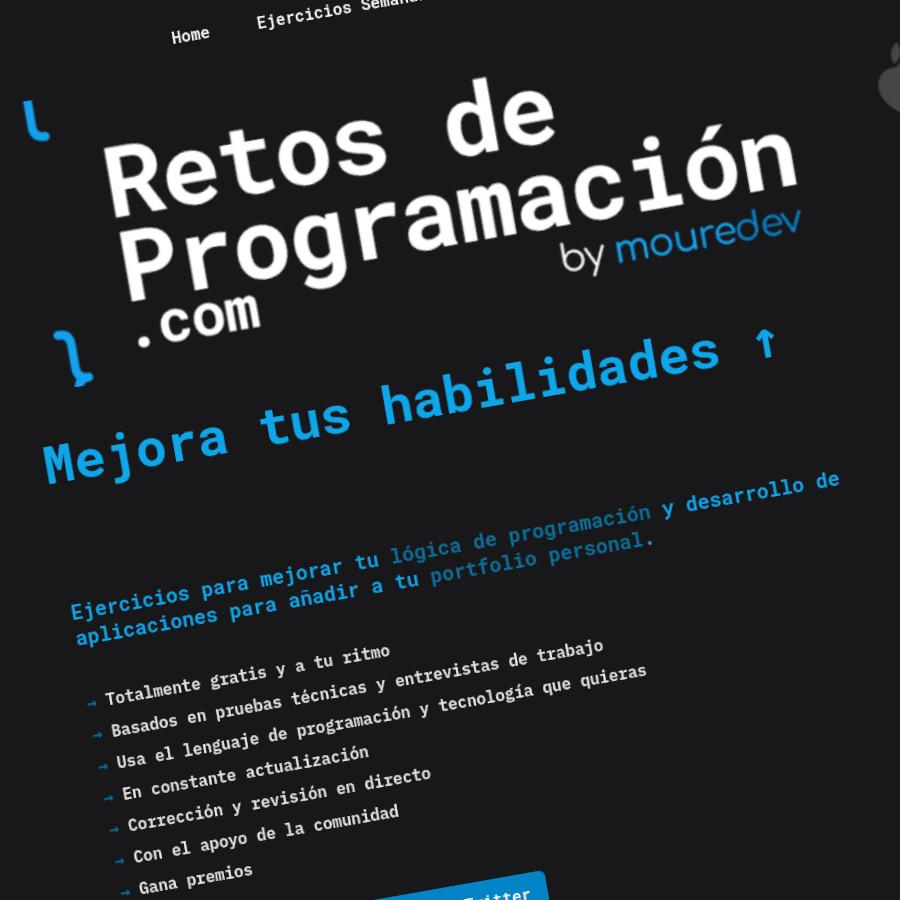

# Retos-LOGICA-programacion-con-Brais-Moure-usando-Python

# TODOS los ejercicios prácticos aquí presentados son guiados por el programa de Brais Moure, partiendo desde lo más básico e incrementando el nivel progresivamente.
# Se realizan de la manera más fácil, comprensible y secuenciados posible, para que todo el mundo pueda seguirlos. 
# Cualquier implementación de mejora es siempre bienvenida, pero hay que tener en cuenta que se hará una evolución en el proceso de ejecución de cada ejercicio.
# Estos ejercicios NO pretenden ser una "regla" que haya que seguir al pie de la letra. Tan sólo SON un GUIÓN.
# TODOS los consejos, sugerencias, anotaciones, indicaciones, críticas (siempre que sean CONSTRUCTIVAS), comentarios, etc son y serán BIENVENIDOS.
<a href="mailto:loquelojonove1975@gmail.com" target="_blank" title="Email" rel="noopener"></i></a>
